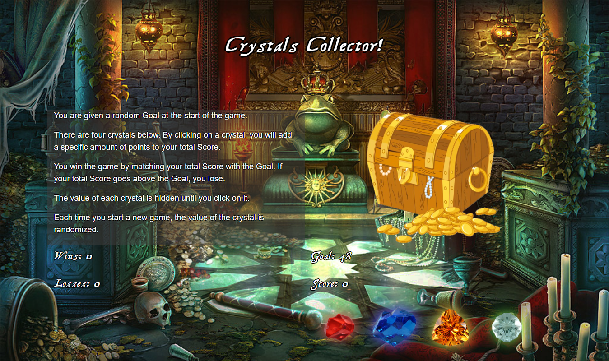

# Crystal Collector!

Open the treasure chest by clicking the gems to match your score with the goal.

## Getting Started

You can find the game at this link.
[Crystals Collector!](https://liangbryan2.github.io/Crystal-Game/)

### Prerequisites

This game was tested on Google Chrome but should work on any internet browser.

```
Google Chrome
Firefox
Microsoft Edge
etc.
```
### Images



### Code Snippets

``` js
$(document).ready(function () {
    $(".loader span").css("background", randomGem());
    $(".loader span").hide();
    game.initialize();
    $(".button").on("click", function () {
        $(".loader span").hide();
        $("#top").attr("src", "assets/images/treasure-closed.png");
        game.addScore(this.value);
        game.checkIfWin();
    });
});
```

## Built With

* HTML
* Javascript/jQuery
* CSS/Bootstrap

## Learning Points

This project was built with the goal of learning jQuery. As you can see from the code snippet, there are selectors, attribute assigners, and other jQuery related functions. The pure Javascript functions are being called on by an object. Objects are stil fairly new to me, so that was a fun experience. Another big thing I learned from this project was CSS animations. The gems that you click on glow and bounce. There's also a surpirse for you when you win the game.

## Author

**Bryan Liang** - [My Github](https://github.com/liangbryan2)

## License

This project is licensed under the MIT License - see the [LICENSE.md](LICENSE.md) file for details
